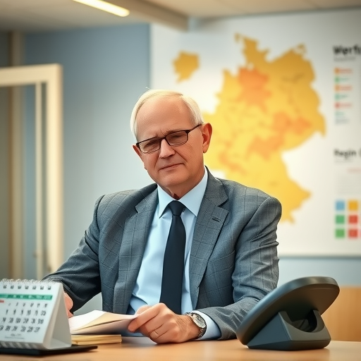
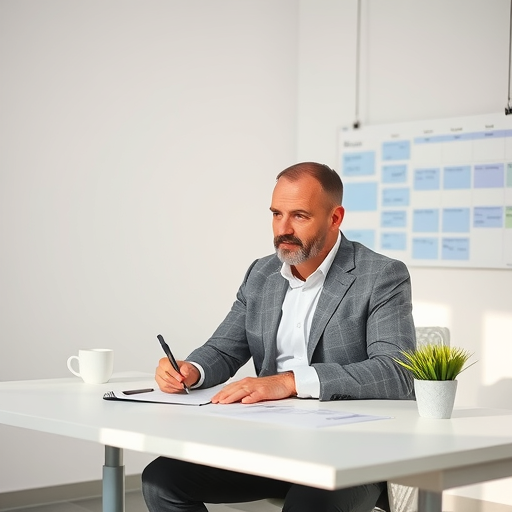
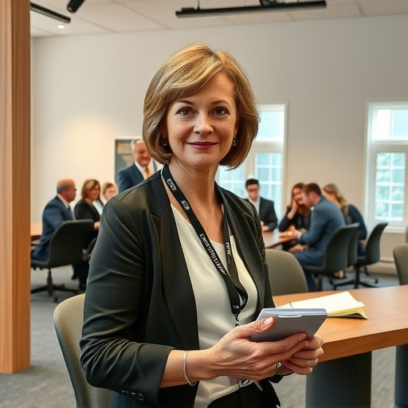

<!--
author:   Berit Edlich

email:    beritedlich@web.de

version:  0.0.1

edit:     true

language: german

comment: Dies ist meine Abschlusspräsentation.

import: https://raw.githubusercontent.com/LiaTemplates/Chat-Simulation/main/README.md

-->

# Abschluss

## Im Chat sind ...


Hier findest du eine kurze Übersicht über die Teilnehmenden an der 
Diskussion. Jede Person bringt ihre eigene Perspektive und Arbeitsweise 
mit – gemeinsam schaffen wir einen strukturierten, aber offenen Austausch.

---

Beate
===

*Referentin, Bundesministerium, Bonn*

Beate steht für eine nationale Perspektive und setzt auf traditionelle 
Hierarchien. Ihre Arbeit ist geprägt von Stabilität, Verlässlichkeit und 
einem klaren Blick auf die gesamtstaatliche Verantwortung. Sie ist eine 
feste Größe, die die Strukturen bewahrt – und dabei stets auf den 
langfristigen Erfolg achtet.

<!-- style="width: 300px; height: auto; display: block; margin: 0 auto; float: left;" -->

---

Manfred
===

*Referatsleiter, Mecklenburg-Vorpommern*

Manfred vertritt die Interessen seines Bundeslandes mit großer Hingabe – 
und hat dabei oft wenig Zeit für die Gruppendiskussion. Sein Fokus liegt 
auf konkreten, umsetzbaren Lösungen. Er ist ein Mann der Aktion, der 
stets im Zeitdruck agiert, aber stets präsent bleibt, wenn es um die 
Belange seiner Region geht.

<!-- style="width: 300px; height: auto; display: block; margin: 0 auto; float: left;" -->

---

Bernhardt
===

*Referent, Berlin/Brandenburg*

Ein Pragmatiker mit scharfem Blick für Details. Bernhardt geht nicht 
über den Tellerrand, sondern schaut genau hin – wo es klemmt, wo es 
hakt, wo es besser geht. Seine Stärke liegt in der Analyse, der 
Strukturierung und der präzisen Umsetzung. Er ist derjenige, der die 
feinen Unterschiede sieht, bevor andere sie bemerken.

<!-- style="width: 300px; height: auto; display: block; margin: 0 auto; float: left;" -->

---

Sabine
===

*Sacharbeiterin, Baden-Württemberg*

Sabine arbeitet nah an den operativen Herausforderungen – und das spürt 
man. Sie ist jung, flippig, aber äußerst kompetent. Ihre Energie ist 
ansteckend, ihr Blick auf die Praxis ist direkt und unkompliziert. Sie 
bringt frischen Wind in die Diskussion und hält uns am Ball, wenn es um 
die Umsetzung geht.

<!-- style="width: 300px; height: auto; display: block; margin: 0 auto; float: left;" -->

---

Rainer
===

*Referent, Thüringen*

Rainer strebt nach klaren Strukturen und nachhaltigen Lösungen. Er ist 
derjenige, der fragt: „Wie funktioniert das? Wie können wir es 
systematisch aufbauen?“ Sein Ansatz ist methodisch, ruhig und überlegt. 
Er schafft Ordnung in Komplexität – und sorgt dafür, dass wir nicht nur 
reden, sondern auch etwas bewegen.

<!-- style="width: 300px; height: auto; display: block; margin: 0 auto; float: left;" -->

---

Melanie
===

*Moderatorin*

Melanie ist die neutrale Instanz, die den Prozess in Bewegung hält. Sie 
leitet die Diskussion mit Gelassenheit, Offenheit und strategischem 
Blick. Ihre Aufgabe ist es, alle Stimmen zu hören, Spannungen zu 
entschärfen und den Fokus auf das Wesentliche zu lenken. Ohne sie wäre 
die Gruppe leicht ins Chaos geraten – mit ihr bleibt der Weg klar.

<!-- style="width: 300px; height: auto; display: block; margin: 0 auto; float: left;" -->

---


> Info: Alle Personen mit ihren Bildern wurden anonymisiert und ohne Orts- oder Namensangaben erstellt, um die Privatsphäre zu schützen. Die Darstellungen sind stilistisch vereinfacht, aber authentisch im Ausdruck.


## '@Chat 1'

``` javascript    @CHAT
[
  {
    name: 'Melanie',
    message: 
        'Guten Morgen, alle zusammen! 😊 Ich hoffe, Sie hatten einen guten Start in den Tag. Ich schlage vor, wir starten mit der Problemanalyse. Unser Hauptproblem: Es gibt zu wenig laufende CE-Projekte in Deutschland. Wir zahlen mehr ein, als wir zurückbekommen. Können wir uns darauf als Ausgangspunkt einigen? 🤔'
  },
  {
    name: 'Beate',
    message: 
        'Ganz ehrlich, ich finde, wir sollten uns zuerst auf die Kommunen konzentrieren. 🏢 Die Kommunen sind doch die wichtigsten Akteure. Ohne sie kommen wir nicht weiter. Vielleicht sollten wir mehr Druck ausüben.'
  },
  {
    name: 'Manfred',
    message:
        'Moin… Ich hab nicht viel Zeit heute. ⏳ Können wir bitte schneller vorankommen? Ich sehe das Problem eher bei den finanziellen Barrieren. Kommunen in meinem Land können sich die Eigenmittel einfach nicht leisten. Da bringt Druck nichts. 😒'
  },
  {
    name:'Melanie',
    message: 
        'Danke, Manfred. Was denken die anderen dazu? Beate, was sagst du zu den finanziellen Barrieren?'
  },
  {
    name: 'Beate',
    message:
        'Natürlich sind die finanziellen Barrieren ein Thema. Aber ohne Druck auf die Kommunen wird sich nichts ändern.'
  },
  {
    name: 'Bernhardt',
    message:
        'Na ja, Manfred, wenn’s so einfach wäre, könnten wir das Ganze mit einer neuen Förderrichtlinie lösen. Das Hauptproblem ist doch, dass die Verfahren zu komplex sind. Niemand versteht das Programm auf Anhieb. 🤷‍♂️'
  },
    {
    name: 'Sabine',
    message:
        'Ganz genau! Die Anträge sind viel zu aufwendig. 📝 Ich arbeite direkt mit den Kommunen, und die sagen mir immer wieder: "Warum sollen wir uns mit CE rumschlagen, wenn es einfachere Programme gibt?"'
  },
  {
    name: 'Melanie',
    message:
        'Interessanter Punkt, Sabine. Was denkt ihr anderen? Sind die Verfahren wirklich das Hauptproblem?'
  },
  {
    name: 'Rainer',
    message:
        'Ich finde, wir müssen endlich mal die Struktur und die Prozesse durchdenken. 🙄 Diese ewige Diskussion bringt uns nicht weiter. Lasst uns systematisch vorgehen: Problem – Ursache – Ziel – Maßnahme.'
  },
  {
    name: 'Melanie',
    message:
        'Danke, Rainer. Struktur klingt gut. Aber bevor wir weitermachen: Sind wir uns einig, dass die Verfahren zu komplex sind? Oder gibt es andere Meinungen?'
  },
]
```


