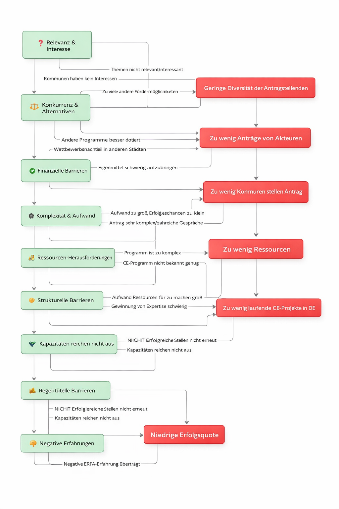

<!--
author:   Berit Edlich

email:    beritedlich@web.de

version:  0.0.1

edit:     true

language: german

comment: Dies ist meine Abschlusspräsentation.

import: https://raw.githubusercontent.com/LiaTemplates/Chat-Simulation/main/README.md

-->

# ImpulsWerk CE


Eine Reise voller Herausforderungen – Erkenntnisse aus dem Projekt ImpulsWerk CE!
---

**Stellt euch vor ...** 

Ihr befindet euch auf einer Reise, die nicht nur ein klares Ziel, sondern auch unzählige Umwege, Hindernisse und überraschende Entdeckungen mit sich bringt. 

Genau so fühlte sich der Weg meiner Abschlussarbeit an. Was als ambitioniertes Vorhaben begann, entwickelte sich zu einer intensiven Suche, einem stetigen Abwägen von Interessen und einem Navigieren durch ein Labyrinth aus Erwartungen und Widerständen. 

Gemeinsam mit fünf Kolleginnen und Kollegen aus verschiedenen Länderverwaltungen und dem Bund – jede und jeder mit ganz individuellen Perspektiven und Organisationsinteressen – haben wir uns auf den Weg gemacht, ein Maßnahmenkonzept zu entwickeln. 

Auf diesem Weg befinden wir uns nach wie vor. Ein Meilenstein ist absolviert. Wir konnten die Probleme ausführlich diskutieren und Ursachen diagnostizieren.

Der Weg dorthin war alles andere als geradlinig. Jeder Schritt erforderte Geduld, Flexibilität und die Bereitschaft, auch mal die Richtung zu ändern.
Besonders spannend war, wie sich die Dynamik in der Gruppe entwickelte: Jeder Einzelne musste sich in seiner Organisation rechtfertigen, Entscheidungen erklären und gleichzeitig offen für neue Ansätze sein. Eine wahre Herausforderung! 

**Was habe ich aus dieser Reise gelernt? ...**

Eine wesentliche Erkenntnis hat sich dabei herauskristallisiert:
Ein offensichtliches Problem ist nicht immer sofort das Kernproblem. Es stellte sich heraus, dass die erste Annahme in die falsche Richtung führte. Erst durch präzise Diskussionen und Analysen konnte das wahre Problem identifiziert werden.


## Über uns


Um die Dynamik unserer Zusammenarbeit zu verdeutlichen, habe ich eine typische Sequenz der Diskussion in Form eines Chats nachgestellt. Hier diskutieren die fünf beteiligten Personen über die Problem- und Ursachenfindung. Jede Figur bringt dabei ihre eigenen Perspektiven und Herausforderungen ein:

---

Beate
===

*Referentin, Bundesministerium, Bonn*

Beate steht für eine nationale Perspektive und setzt auf traditionelle 
Hierarchien. Ihre Arbeit ist geprägt von Stabilität, Verlässlichkeit und 
einem klaren Blick auf die gesamtstaatliche Verantwortung. Sie ist eine 
feste Größe, die die Strukturen bewahrt.

<!-- style="width: 450px; height: auto;"-->

---

Manfred
===

*Referatsleiter, Mecklenburg-Vorpommern*

Manfred vertritt die Interessen seines Bundeslandes mit großer Hingabe – 
und hat dabei oft wenig Zeit für die Gruppendiskussion. Sein Fokus liegt 
auf konkreten, umsetzbaren Lösungen. Er ist ein Mann der Aktion, der 
stets im Zeitdruck agiert, aber stets präsent bleibt, wenn es um die 
Belange seiner Region geht.

<!-- style="width: 450px; height: auto;"-->

---

Bernhardt
===

*Referent, Berlin/Brandenburg*

Ein Pragmatiker mit scharfem Blick für Details. Bernhardt geht nicht 
über den Tellerrand, sondern schaut genau hin – wo es klemmt, wo es 
hakt, wo es besser geht. Seine Stärke liegt in der Analyse, der 
Strukturierung und der präzisen Umsetzung. Er ist derjenige, der die 
feinen Unterschiede sieht, bevor andere sie bemerken.

<!-- style="width: 450px; height: auto;"-->

---

Sabine
===

*Sacharbeiterin, Baden-Württemberg*

Sabine arbeitet nah an den operativen Herausforderungen – und das spürt 
man. Ihre Energie ist ansteckend, ihr Blick auf die Praxis ist direkt und unkompliziert. Sie 
bringt frischen Wind in die Diskussion und hält uns am Ball, wenn es um 
die Umsetzung geht.

<!-- style="width: 450px; height: auto;"-->

---

Rainer
===

*Referent, Thüringen*

Rainer strebt nach klaren Strukturen und nachhaltigen Lösungen. Er ist 
derjenige, der fragt: „Wie funktioniert das? Wie können wir es 
systematisch aufbauen?“ Sein Ansatz ist methodisch, ruhig und überlegt. 
Er schafft Ordnung in Komplexität – und sorgt dafür, dass wir nicht nur 
reden, sondern auch etwas bewegen.

<!-- style="width: 450px; height: auto;"-->

---

Melanie
===

*Moderatorin*

Melanie ist die neutrale Instanz, die den Prozess in Bewegung hält. Sie 
leitet die Diskussion mit Gelassenheit, Offenheit und strategischem 
Blick. Ihre Aufgabe ist es, alle Stimmen zu hören, Spannungen zu 
entschärfen und den Fokus auf das Wesentliche zu lenken. Ohne sie wäre 
die Gruppe leicht ins Chaos geraten – mit ihr bleibt der Weg klar.

<!-- style="width: 450px; height: auto;"-->

---

> *Info.* Alle Personen mit ihren Bildern wurden anonymisiert und ohne Orts- oder Namensangaben erstellt, um die Privatsphäre zu schützen. Die Darstellungen sind stilistisch vereinfacht, aber authentisch im Ausdruck.


## Diskussion


Die Diskussion – Ein Chat als Spiegel des Prozesses
---


```javascript @CHAT
[
  {
    "name": "Melanie",
    "message": "Guten Morgen, alle zusammen! 😊 Ich hoffe, Sie hatten einen guten Start in den Tag. Ich schlage vor, wir starten mit der Problemanalyse. Unser Hauptproblem: Es gibt zu wenig laufende CE-Projekte in Deutschland. Wir zahlen mehr ein, als wir zurückbekommen. Können wir uns darauf als Ausgangspunkt einigen? 🤔"
  },
  {
    "name": "Beate",
    "message": "Ganz ehrlich, ich finde, wir sollten uns zuerst auf die Kommunen konzentrieren. 🏢 Die Kommunen sind doch die wichtigsten Akteure. Ohne sie kommen wir nicht weiter. Vielleicht sollten wir mehr Druck ausüben oder mehr Anreize schaffen."
  },
  {
    "name": "Manfred",
    "message": "Moin… Ich hab‘ nicht viel Zeit heute. ⏳ Können wir bitte schneller vorankommen? Ich sehe das Problem eher bei den finanziellen Barrieren. Kommunen in meinem Land können sich die Eigenmittel einfach nicht leisten. Da bringt Druck nichts. 😒"
  },
  {
    "name": "Melanie",
    "message": "Danke, Manfred. Was denken die anderen dazu? Beate, was sagst du zu den finanziellen Barrieren?"
  },
  {
    "name": "Beate",
    "message": "Natürlich sind die finanziellen Barrieren ein Thema. Aber ohne Druck auf die Kommunen wird sich nichts ändern."
  },
  {
    "name": "Bernhardt",
    "message": "Na ja, Manfred, wenn’s so einfach wäre, könnten wir das Ganze mit einer neuen Förderrichtlinie lösen. Das Hauptproblem ist doch, dass die Verfahren zu komplex sind. Niemand versteht das Programm auf Anhieb. 🤷‍♂️"
  },
  {
    "name": "Sabine",
    "message": "Ganz genau! Die Anträge sind viel zu aufwendig. 📝 Ich arbeite direkt mit den Kommunen, und die sagen mir immer wieder: \"Warum sollen wir uns mit CE rumschlagen, wenn es einfachere Programme gibt?\""
  },
  {
    "name": "Melanie",
    "message": "Interessanter Punkt, Sabine. Was denkt ihr anderen? Sind die Verfahren wirklich das Hauptproblem?"
  },
  {
    "name": "Rainer",
    "message": "Ich finde, wir müssen endlich mal die Struktur und die Prozesse durchdenken. 🙄 Diese ewige Diskussion bringt uns nicht weiter. Lasst uns systematisch vorgehen: Problem – Ursache – Ziel – Maßnahme."
  },
  {
    "name": "Melanie",
    "message": "Danke, Rainer. Struktur klingt gut. Aber bevor wir weitermachen: Sind wir uns einig, dass die Verfahren zu komplex sind? Oder gibt es andere Meinungen?"
  },
  {
    "name": "Manfred",
    "message": "Ja, das passt so. Können wir jetzt bitte über die Maßnahmen sprechen? Mein Chef erwartet Ergebnisse. 📈"
  },
  {
    "name": "Beate",
    "message": "Nein, das passt für mich nicht ganz. Ich finde, wir müssen unbedingt mehr auf die Kommunen eingehen. 🏘️ Ohne sie brauchen wir hier gar nicht weitermachen."
  },
  {
    "name": "Bernhardt",
    "message": "Beate, die Kommunen sind nicht der heilige Gral. Das Problem ist größer. Wenn niemand versteht, wie man einen Antrag stellt, bringt auch kein Druck auf die Kommunen etwas. 🤔"
  },
  {
    "name": "Sabine",
    "message": "Können wir uns jetzt bitte mal auf das Hauptproblem konzentrieren? 🛑 Wir haben zu wenig Anträge, zu wenig Projekte und zu wenig Newcomer. Alles andere ergibt sich doch daraus."
  },
  {
    "name": "Melanie",
    "message": "Okay, ich fasse mal zusammen: Wir haben finanzielle Barrieren, strukturelle Barrieren, ein komplexes Verfahren und zu wenig Bekanntheit des Programms identifiziert. Können wir uns darauf einigen? Oder fehlt noch etwas?"
  },
  {
    "name": "Rainer",
    "message": "Können wir einfach weitermachen? Dieses Hin und Her bringt uns nicht weiter. ⏳"
  },
  {
    "name": "Beate",
    "message": "Lösungen? Ach, Rainer, ich dachte, wir machen das hier nur zum Spaß. 🙄"
  },
  {
    "name": "Melanie",
    "message": "Beate, das war jetzt nicht ganz konstruktiv. 😅 Aber ich verstehe deinen Punkt. Was denkt ihr anderen? Sind wir uns einig, dass diese vier Punkte die Hauptprobleme sind?"
  },
  {
    "name": "Manfred",
    "message": "Oh, dauert das lange… Ist das nicht ein wenig umständlich? 😩"
  },
  {
    "name": "Melanie",
    "message": "Ich habe da mal eine Grafik vorbereitet, die die Probleme und Ursachen zusammenfasst. 📊" 
  },
  {
    "name": "Melanie",
    "message": " Etwas größer unter dem [Link](./img/flussdiagramm.jpg) Passt das so für euch?"
  },
  {
    "name": "Sabine",
    "message": "Ja, das trifft es ziemlich gut. Aber wir müssen bei den Maßnahmen wirklich pragmatisch bleiben."
  },
  {
    "name": "Bernhardt",
    "message": "Die Grafik ist hilfreich. Aber wir sollten uns jetzt auf die Maßnahmen konzentrieren."
  },
  {
    "name": "Melanie",
    "message": "Danke für das Feedback! 😊 Ich denke, die Grafik hilft uns, die Diskussion zu strukturieren. Aber bevor wir zu den Maßnahmen kommen, möchte ich sicherstellen, dass wir alle auf dem gleichen Stand sind."
  },
  {
    "name": "Beate",
    "message": "Ja, okay. Aber ich komme nochmal auf das Thema Kommunen zurück, wenn wir die Maßnahmen ausarbeiten. 🏘️"
  },
  {
    "name": "Manfred",
    "message": "Ja, ich denke auch, dass diese Grafik unser Gespräch etwas mehr strukturieren kann und für das nächste Treffen hilfreich ist."
  },
  {
    "name": "Melanie",
    "message": "Super, dann haben wir zumindest einen Zwischenstand. 🎉"
  },
  {
    "name": "Beate",
    "message": "👍"
  },
  {
    "name": "Rainer",
    "message": "👍"
  },
  {
    "name": "Bernhardt",
    "message": "👍"
  },
  {
    "name": "Sabine",
    "message": "Ich finde, wir sollten jetzt endlich zu den Maßnahmen kommen."
  },
  {
    "name": "Melanie",
    "message": "Das machen wir beim nächsten Treffen. Aber ich möchte nochmal betonen: Wir müssen uns zuerst über die Probleme und Ursachen einig sein. 📊 Das ist ein durchdachter Prozess, der uns am Ende auch hilft, die Wirkung unserer Maßnahmen zu bewerten."
  },
  {
    "name": "Rainer",
    "message": "Na endlich. Dann bis zum nächsten Mal."
  },
  {
    "name": "Beate",
    "message": "Ja, okay. Aber ich komme nochmal auf das Thema Kommunen zurück, wenn wir die Maßnahmen ausarbeiten. 🏘️"
  },
  {
    "name": "Melanie",
    "message": "Alles klar, Beate. Dann wünsche ich euch allen noch einen erfolgreichen Tag! 😊"
  }
]
```
